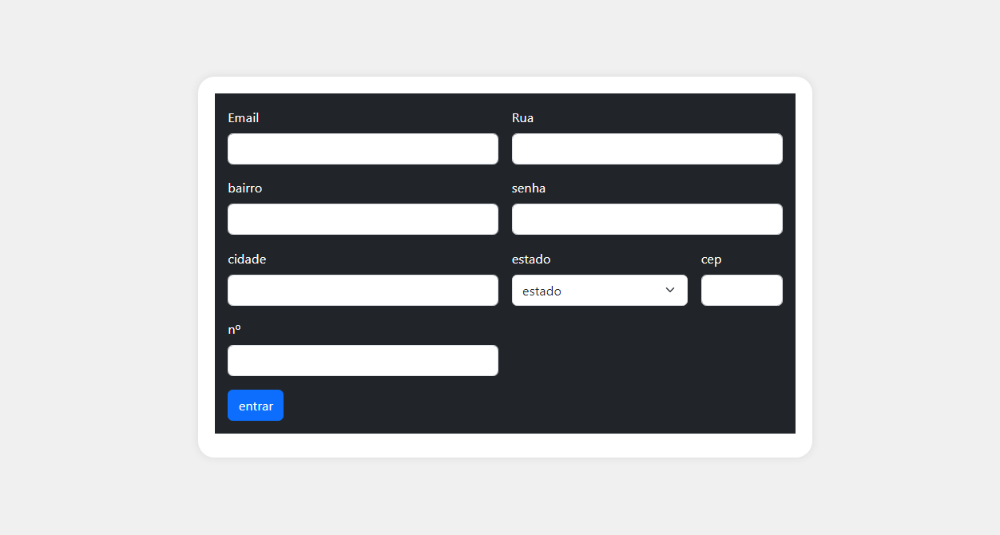

#  form cadenderecos 

## ⚜️ Índice ⚜️

## 🌛imagem do projeto 🌜🪽

---

[Descrição](#descri%C3%A7%C3%A3o)

[Introdução](#introdu%C3%A7%C3%A3o)

[Funcionalidades](#funcionalidades)

[Tecnologias Utilizadas](#tecnologias-utilizadas)

[Fontes Consultadas](#fontes-consultadas)

### descrição 

este é uma projeto com a funcionalidade de uma tela de cadastro com preenchimento automatico de campo de endereço 

### introdução 

este é um projeto de tala de cadastro que realiza o preenchimento automatico dos campos de rua bairro e cidade apos o preenchimento do campo cep utilizando a api da via cep 

### funcionalidades

1. **preenchimento de campos:** au celecionar o cep ele fais o preenchimento automatico dos capo de endereço

2. **verifica se o cep tem 8 digitos:** por meio de uma expreção regular que valida para saber se o cep possui 8 digitos

3. **verifica se o cep é valido :** por meio de outra expresão regular que verufica se o cep e valido 

### Tecnologias Utilizadas

1. **html 5:** para a base do projeto

2. **bootstrap 5:** para o corpo da pagina e estilisação da pagina

3. **css:** para estilização basica da pagina

4. **java script:**para as verificações e para a comsulta da api via cep

### funções utilizadas

1_ **async:** Quando uma função assíncrona é chamada, ela retorna uma Promise. Quando a função assíncrona retorna um valor, a Promise será resolvida com o valor retornado. Quando a função assíncrona lança uma exceção ou algum valor, a Promise será rejeitada com o valor lançado.

2_ **hasOwnProperty:** Todo objeto descendente de Objectherda o método hasOwnProperty. Este método pode ser usado para determinar se um objeto possui uma propriedade especificada como propriedade direta do objeto.

3_ **await:** A expressão await faz a execuç ão de uma função async pausar, para esperar pelo retorno da Promise, e resume a execução da função async quando o valor da Promise é resolvido. Ele então retorna o valor final da Promise. Se esse valor não for uma Promise, ele é convertido para uma Promise resolvida.

4_ **fetch:** A API Fetch fornece uma interface JavaScript para acessar e manipular partes do pipeline HTTP, tais como os pedidos e respostas. Ela também fornece o método global fetch() que fornece uma maneira fácil e lógica para buscar recursos de forma assíncrona através da rede.
Este tipo de funcionalidade era obtida anteriormente utilizando XMLHttpRequest. Fetch fornece uma alternativa melhor que pode ser facilmente utilizada por outras tecnologias como Service Workers. Fetch também provê um lugar lógico único para definir outros conceitos relacionados ao protocolo HTTP como CORS e extensões ao HTTP.

5_ **addres:**  O elemento HTML <address> fornece informações de contato para seu ancestral <article> ou <body> mais próximo; no segundo caso, ele se aplica ao documento inteiro.
A informação de contato fornecida por um conteúdo do elemento <address> pode tomar qualquer forma que é apropriada para o contexto, e pode incluir qualquer tipo de informação de contato necessária, como endereço físico, URL, email, telefone, mídia social, coordenadas geográficas, por aí vai. Deve incluir o nome da pessoa, grupo, ou organização para qual as informações de contato se referem.
<address> pode ser usado em uma variedade de contextos, como fornecer informação de contato de uma empresa no header da página, ou indicar o autor de um artigo incluindo um elemento <address> dentro do <article>.

### Fontes Consultadas 

1- [bootstrap site](https://getbootstrap.com/)
2- [via cep api](https://viacep.com.br/)
3- [mdm web docs](https://developer.mozilla.org/pt-BR/)
4- [git para ajuda na estrutura do readm](https://github.com/NickSilvaDavila/cadlog-system)

##  Autor 
Felipe da Silva Gonçalves - 2ºB
